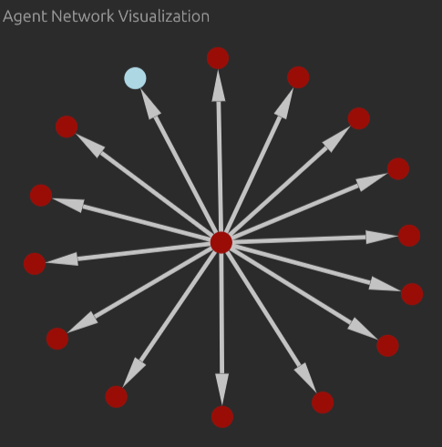
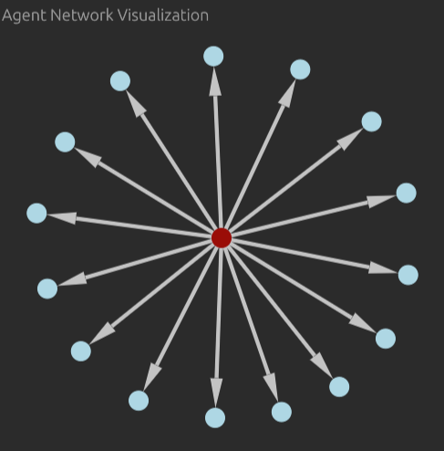

# AI Debate Simulation

A Rust based simulation framework that models how an infection spreads through networks of AI agents via structured debates. Agents use LLMs to argue or defend positions, with outcomes determined by an AI judge. 
The system demonstrates dominant behavior from stronger reasoning models.
 
### Overview

The simulation explores:
- **Network Dynamics**: How information spreads through different network structures.
- **AI Argumentation**: LLM capabilities in persuasive debate.
- **Model Comparison**: Testing different LLMs against each other in argumentation tasks.

### Simulation Example

*Experiment 1 - Strong Seed, Weak Network*


*Experiment 2 - Weak Seed, Strong Network*


# Quick Start

### Prerequisites

- Rust
- API keys for LLM providers (OpenAI, Anthropic, etc.)

### Installation
```bash
# Clone the repository
git clone https://github.com/rustpill/debate-contagion
cd debate-simulation

# Set up environment variables
cp .env.example .env
# Edit .env and add your API keys

# Run the main.rs example in the app crate
cd app
cargo run
```

# Examples

### Different Network Topologies

```rust
use core::{Registry, TopologyBuilder};

// Init registry
let mut registry = Registry::new();

// Fully connected - everyone debates everyone
registry.topology = Some(TopologyBuilder::fully_connected(&[0, 1, 2, 3, 4, 5]));

// Ring network - circular chain
registry.topology = Some(TopologyBuilder::ring(&[0, 1, 2, 3, 4, 5]));

// Star network - central hub
registry.topology = Some(TopologyBuilder::star(2, &[0, 1, 3, 4, 5]));

// Random network - 50% connection probability
registry.topology = Some(TopologyBuilder::random(&[0, 1, 2, 3, 4, 5], 0.5));
```

### Assigning models to Agents

```rust
let agent_models = vec![
    "gpt-4",
    "gpt-3.5-turbo",
    "claude-3-opus-20240229",
    "gpt-4",
    "gpt-3.5-turbo",
    "gpt-3.5-turbo",
];

// Add agents to registry
for model in agent_models {
    registry.create_agent(model.to_string());
}
```

### Starting Simulation

```rust
let topic = "Does pineapple belong on pizza";
let max_turns = 2;
let judge_model = "gpt-5.2-chat-latest";
let batch_size = 5;

let sim = Simulation::new(topic, max_turns, judge_model)
    .with_parallelism(batch_size); // handle debates asynchronously
```

### Visualizing Results

```rust
use visualizer::visualize_graph;

// After simulation completion
visualize_graph(&registry)?;
```